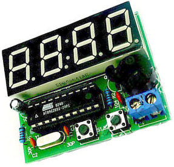
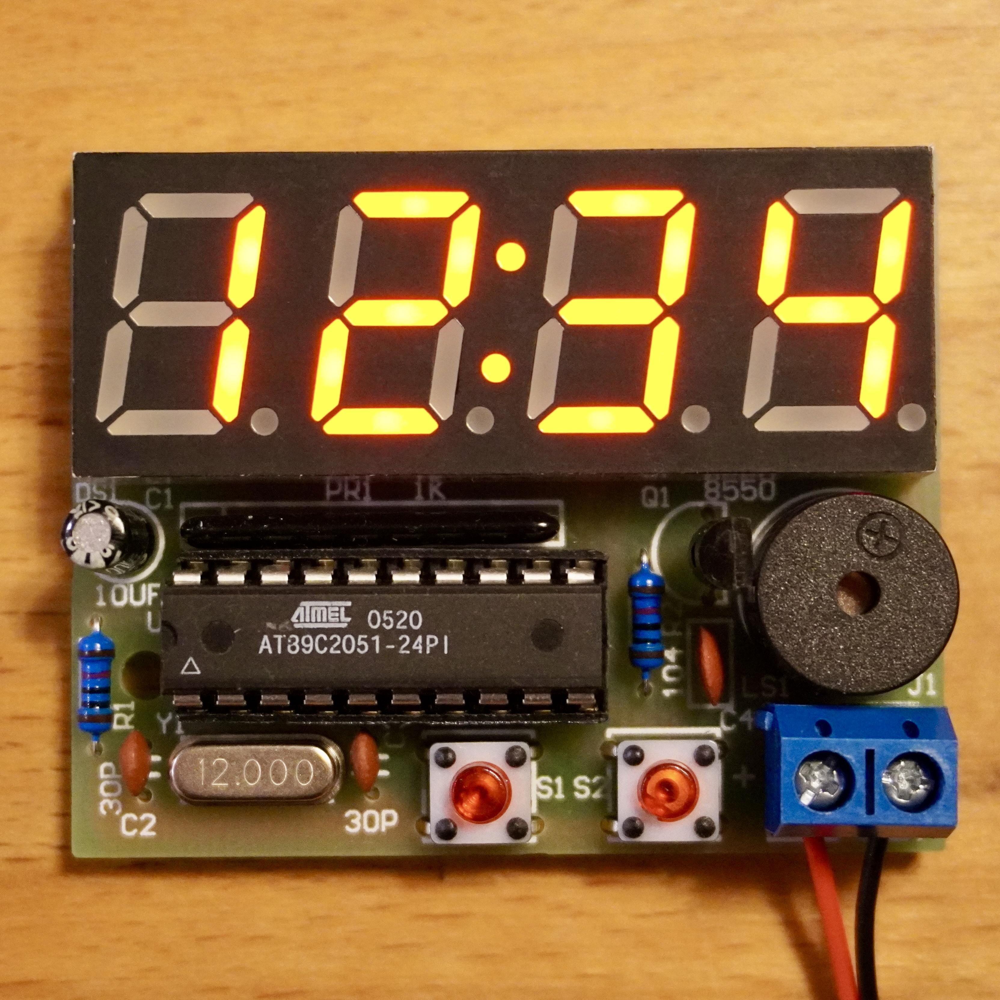
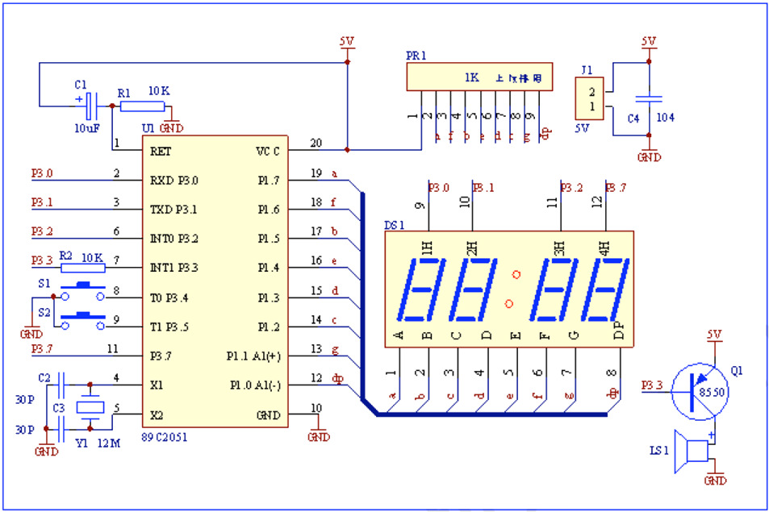
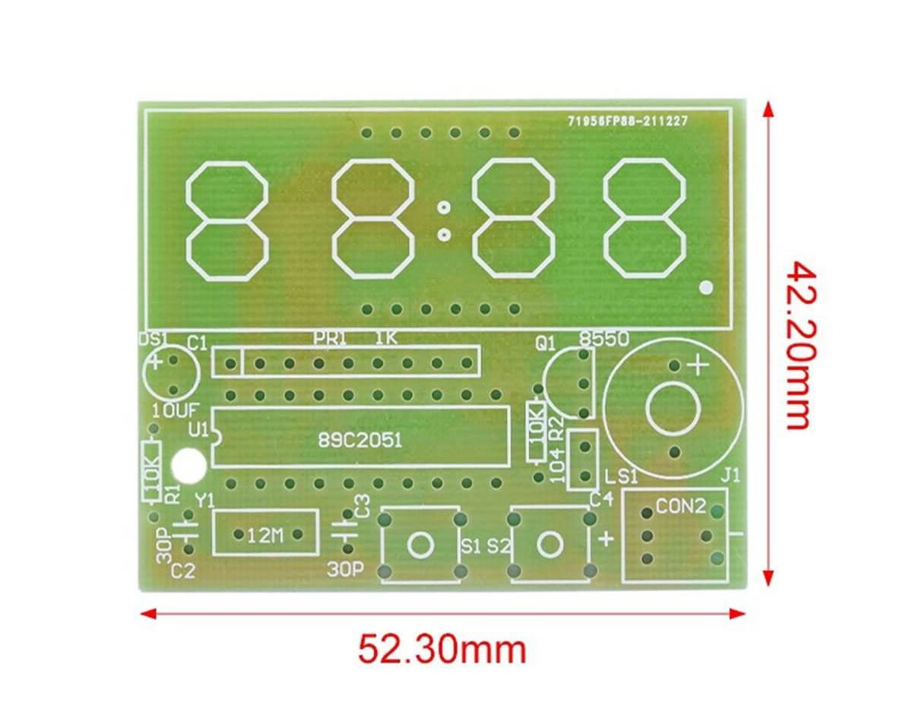



# 1. デジタル電子時計

電子時計は、AT89C2051 をコアとして使用し、合計 16 個の電子コンポーネントを使って作成します。また「時/分」または「分/秒」の時計、時刻設定、8:00-20:00 の時報チャイム、2 つの独立したアラームなどの機能を備えています。

 

(<a href="#readme-top">back to top</a>)

# 2. コンポーネントリスト

| 番号 | 名前                 | タイプ/仕様              | 識別子 | 方向 |
| ---- | -------------------- | ------------------------ | ------ | ---- |
| 01   | 抵抗                 | 10K                      | R1     | なし |
| 02   | 抵抗                 | 10K                      | R2     | なし |
| 03   | セラミックコンデンサ | 30pf                     | C2     | なし |
| 04   | セラミックコンデンサ | 30pf                     | C3     | なし |
| 05   | セラミックコンデンサ | 104pf                    | C4     | なし |
| 06   | 電解コンデンサ       | 10uF / 25v               | C1     | あり |
| 07   | 集合抵抗             | 1K                       | PR1    | あり |
| 08   | 水晶発振子           | 12MHz                    | Y1     | なし |
| 09   | トランジスタ         | 8550                     | Q1     | あり |
| 10   | タクトスイッチ       | 6x6x5                    | S1     | あり |
| 11   | タクトスイッチ       | 6x6x5                    | S2     | あり |
| 12   | IC ソケット          | 20 ピン                  | U1     | あり |
| 13   | マイクロコントローラ | AT89C2051                | U1     | あり |
| 14   | ブザー               | 5v アクティブ            | LSI    | あり |
| 15   | ディスプレイ         | 4 ポジ 7 セグ モジュール | DS1    | あり |
| 16   | DC コネクタ          | 2 ポジ 3.5mm ターミナル  | J1     | あり |
| 17   | プリント基板         | 52x42mm                  |        |      |

(<a href="#readme-top">back to top</a>)

# 3. 概要

マイクロコントローラ を用いた、キー入力回路、表示回路、ブザー回路、電源部を持つ最小限のシステムです。  
電源電圧は 3V-5.5V です。5.2V を超えないでください。  
電源を入れると、ディスプレイに 12:59 が表示されます。デフォルトでは、両方のアラームがオンになり、最初のアラームは 13:01 に設定され、2 番目のアラームは 13:02 に設定されています。

1. マイクロコントローラ の最小システムには、パワーオン リセット回路用の U1 (AT89C2051)、C1、R1 が含まれます。クロック回路は C2、C3、Y1 で構成されます。
2. 押下キー入力回路は S1、S2 で構成されており、大きなブザーが鳴ったらボタンを短く押し、大きなブザーが 2 回鳴ったらボタンを長押しします。
3. 表示回路： 4 ビットのカソードコモンと PR1 抵抗 1 個パック。
4. ブザー回路は Q1、R2、LS1 で構成されており、大きなブザーが鳴ったらボタンを短く押し、大きなブザーが 2 回鳴ったらボタンを長押しします。
5. J1 は 5V 電源入力端子、C4 はフィルタです。

(<a href="#readme-top">back to top</a>)

# 4. 操作説明

電源を入れると、通常のインターフェイス (「時:分」) で 12:59 が表示されます。また目覚まし時計の両方のチャネルが開きます。同時に、最初の目覚まし時計は 13:01 に設定され、2 番目の目覚まし時計は 13:02 に設定されています。

電源投入後、S2 を短く押すとデジタル管の表示が「時：分」と「分：秒」に切り替わります。

S1 を長押しして、システム設定メニューに入ります。 A、B、C、D、E、F、G、H、I、J のサブメニューがあります。
S1 を短く押すとサブメニューが切り替わり、最後に通常の表示に戻ります。

| サブメニュー | 機能                 | 説明                                                                                                     |
| ------------ | -------------------- | -------------------------------------------------------------------------------------------------------- |
| A            | 時間の設定           | S2 を押すごとに 1 加算されます。                                                                         |
| B            | 分の設定             | S2 を押すごとに 1 加算されます。                                                                         |
| C            | 時報                 | デフォルトは ON です（ 8:00 から 20:00 まで）。S2 を押すごとに ON/OFF が切り替わります。                 |
| D            | １番目のアラーム     | デフォルトの状態は ON です。S2 を押すと、ON と OFF が切り替わります。                                    |
| E            | アラームの時間の設定 | S2 を押すごとに 1 加算されます。                                                                         |
| F            | アラームの分の設定   | S2 を押すごとに 1 加算されます。                                                                         |
| G            | ２番目のアラーム     | デフォルトの状態は ON です。S2 を押すと、ON と OFF が切り替わります。                                    |
| H            | アラームの時間の設定 | S2 を押すごとに 1 加算されます。                                                                         |
| I            | アラームの分の設定   | S2 を押すごとに 1 加算されます。                                                                         |
| J            | クロック速度調整     | S2 を押すごとに 1 加算されます。 合計 9 つの速度があり、数値が大きいほど、クロックの動作が速くなります。 |

## 4.1. 秒の設定:

通常のインターフェイスで S2 を短く押すと、「分:秒」インターフェイスに入ります。  
S2 を長押しすると秒がゼロになり、時計が止まります。  
次に、S2 を 2 回短く押すとクロックが開始され、通常のインターフェイスに入ります。

(<a href="#readme-top">back to top</a>)

# 5. 回路図

注: PR1 抵抗には方向があり、ボード上にパッドが 1 つあり、シルクスクリーンでその周囲に四角形が描かれています。これがピン 1 です。抵抗パックの 1 つのピンの近くには、ピン 1 であることを示すドットがあります。

(<a href="#readme-top">back to top</a>)

# 6. その他

- [4Bit Clock Kit PDF (English)](./docs/4BitClockKit.pdf)

(<a href="#readme-top">back to top</a>)

